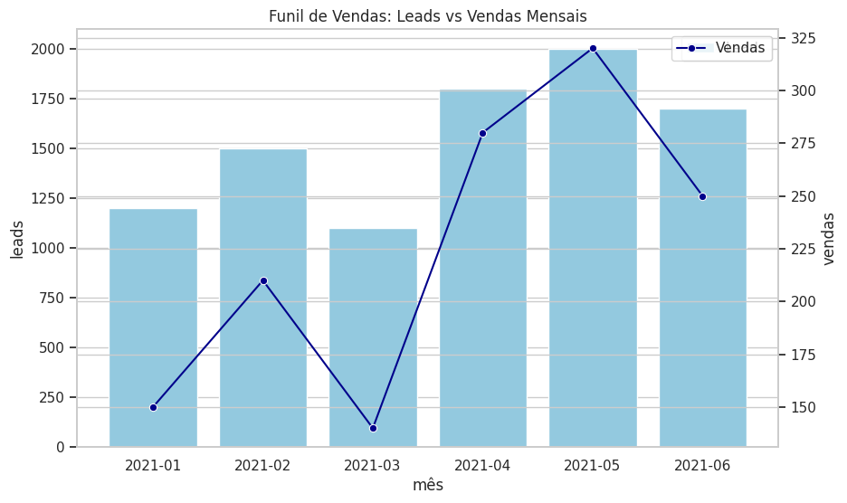
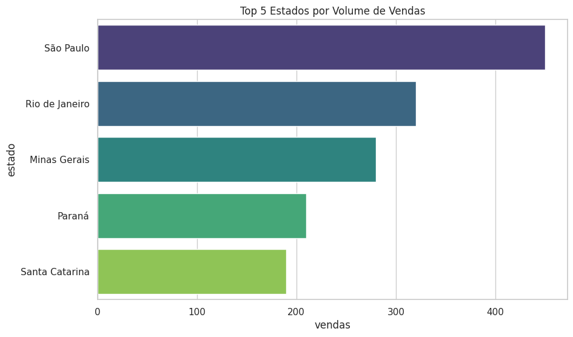

# Projeto de Análise de Vendas e Funil de Conversão

Este repositório apresenta uma análise completa de dados de vendas, focada em métricas de desempenho, comportamento regional e funil de conversão. O projeto demonstra habilidades em **SQL** para manipulação de dados e **Python** para visualização de insights.

## 📊 Visualizações do Projeto

Abaixo estão os principais indicadores extraídos das consultas SQL:

### 1. Funil de Vendas (Leads vs Vendas)
Acompanhamento mensal da geração de leads e a conversão efetiva em vendas, permitindo identificar a eficiência do time comercial.

### 2. Desempenho Regional
Análise dos 5 estados com maior volume de transações, essencial para estratégias de expansão e logística.

### 3. Market Share por Marca
Distribuição das vendas entre as principais marcas do portfólio.

## 📂 Estrutura do Repositório

- `queries_vendas.sql`: Scripts SQL com as lógicas de negócio e extração de KPIs.
- `img/`: Pasta contendo as visualizações geradas.
- `generate_viz.py`: Script Python utilizado para gerar os gráficos automaticamente.

## 🛠️ Tecnologias Utilizadas

- **SQL**: Extração e tratamento de dados complexos.
- **Python (Pandas/Seaborn)**: Análise estatística e visualização de dados.
- **GitHub**: Documentação e controle de versão.

---

## 💡 Como subir suas próprias imagens no GitHub

Se você quiser substituir estas imagens pelos seus prints do Power BI, siga estes passos simples:

1.  Acesse a pasta `img` no seu repositório pelo navegador.
2.  Clique em **"Add file"** -> **"Upload files"**.
3.  Arraste seus prints para lá (tente manter os mesmos nomes de arquivo como `funil_vendas.png` para que o README atualize automaticamente).
4.  Clique em **"Commit changes"** no final da página.

Pronto! Seu portfólio ficará sempre atualizado.
